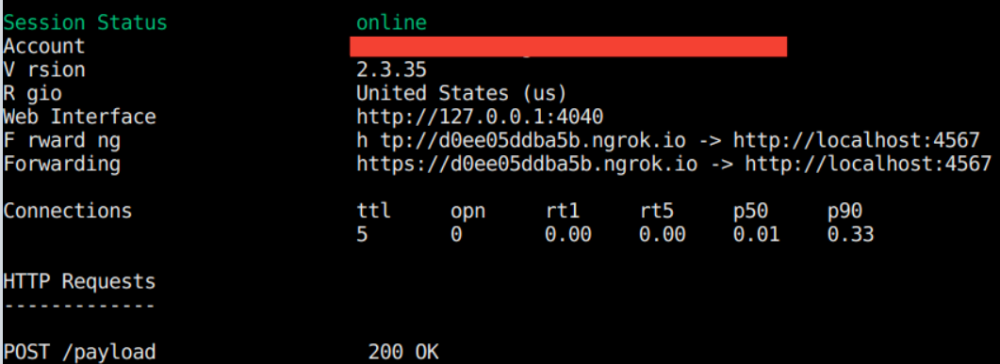
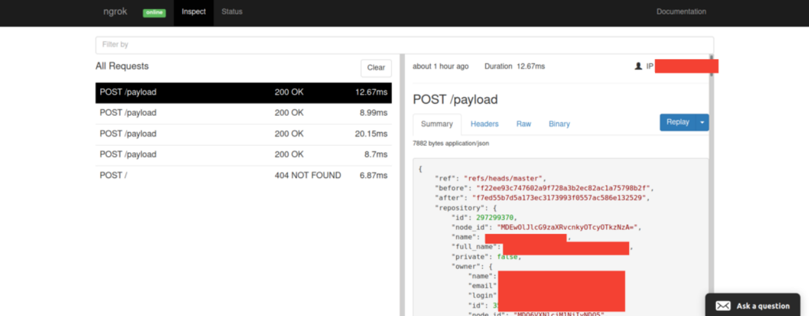

# Quick Flask Server

A simple way to acess your Flask apps on the internet while running it on localhost. 

## Compatability
Python 3.6+ is required.

## Installation

```bash
pip install quick-flask-server
```
## Quickstart
1. Import with ```from quick_flask_server import run_with_ngrok```
2. Add `run_with_ngrok(app)` to make your Flask app available upon running
```python
# example.py
from flask import Flask
from quick_flask_server import run_with_ngrok

app = Flask(__name__)
run_with_ngrok(app)  # Start ngrok when app is run

@app.route("/")
def hello():
    return "Hello World!"

if __name__ == '__main__':
    app.run()
```
Running the example:
```bash
python quick_flask_server/example.py
 * Running on http://127.0.0.1:5000/ (Press CTRL+C to quit)
 * Running on http://<random-address>.ngrok.io
 * Traffic stats available on http://127.0.0.1:4040 
```

You might also see this, 



You can copy the ngrok URL also from here.

As shown in the above image ngrok has a web-interface which can be accessed at localhost:4040

Here is a sample image of the web interface,


